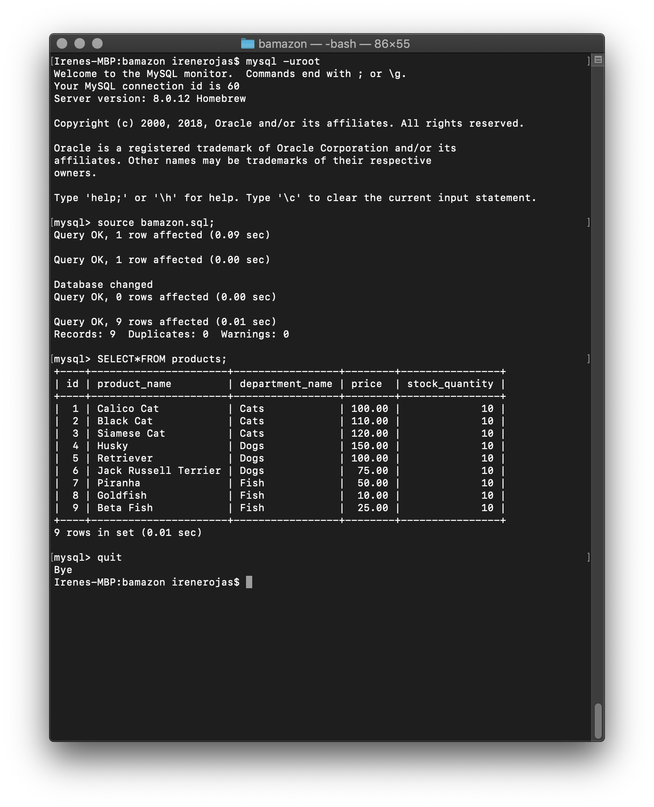
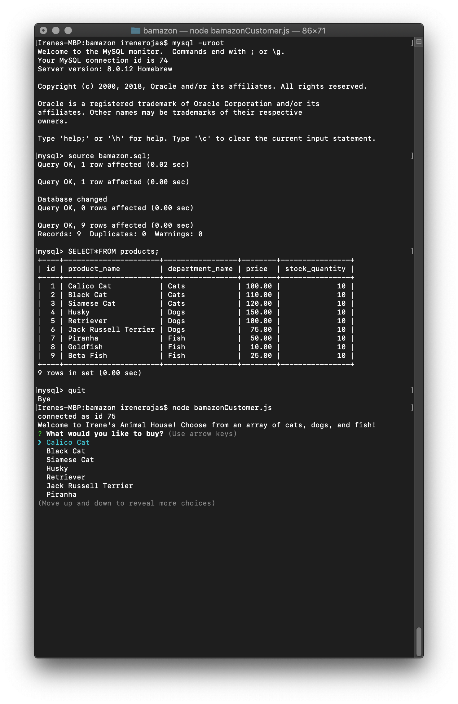
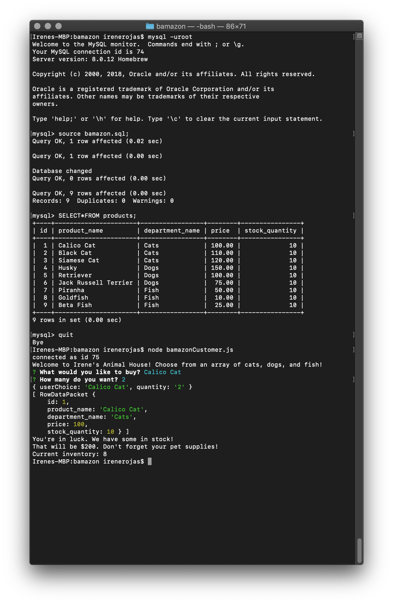
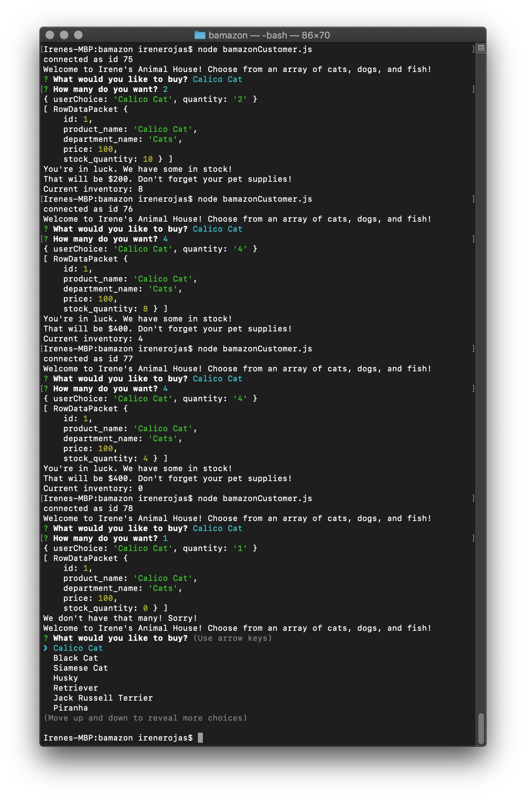

## Irene's Animal House
aka, bamazon

Requirements: pull the project repo and do "npm install"
Dependencies: mysql, inquirer

This is a command-line project created for the fall 2018 full-stack web development class at George Washington University. 

It is an Amazon-type store, where the customer requests a product, and the store sells it if it's in stock. 

I have attached screenshots of the transaction in progress.
(bamazonCustomer.js)

This is the store's inventory when fully stocked. 

When the customer enters the store, they are asked to choose their item. 

The sales associate asks how many of the items the customer would like. They then check the inventory to confirm there are enough of the items to fulfill the order.

In this example, I show what happens when a series of customers deplete an item's inventory. 

